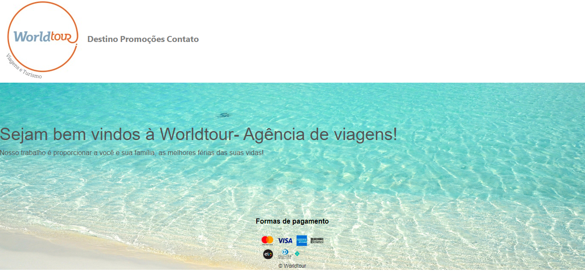
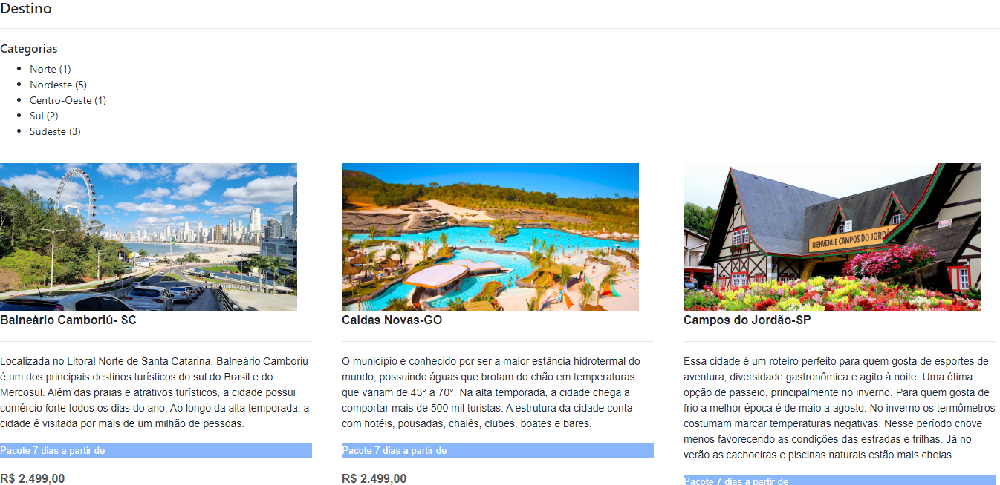
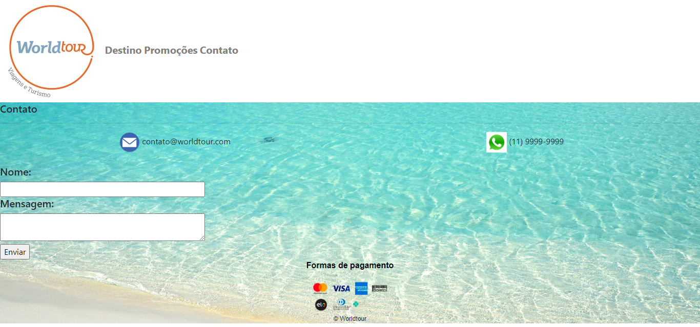

# Worldtour-Agencia-de-Viagens

Projeto pessoal de uma agência de viagens, que faz parte de um processo de aprendizagem. Dentro do curso de Desenvolvedor FullStack, foi proposto o desafio de criarmos uma agência de viagens. Esse é um protótipo, uma ideia de como seria o site.

##Requisitos do projeto
- Esse projeto cria uma agência de viagens
- Oferece opções de destino
- Oferece opções  de destino com promoções
- Uma página com os contatos

